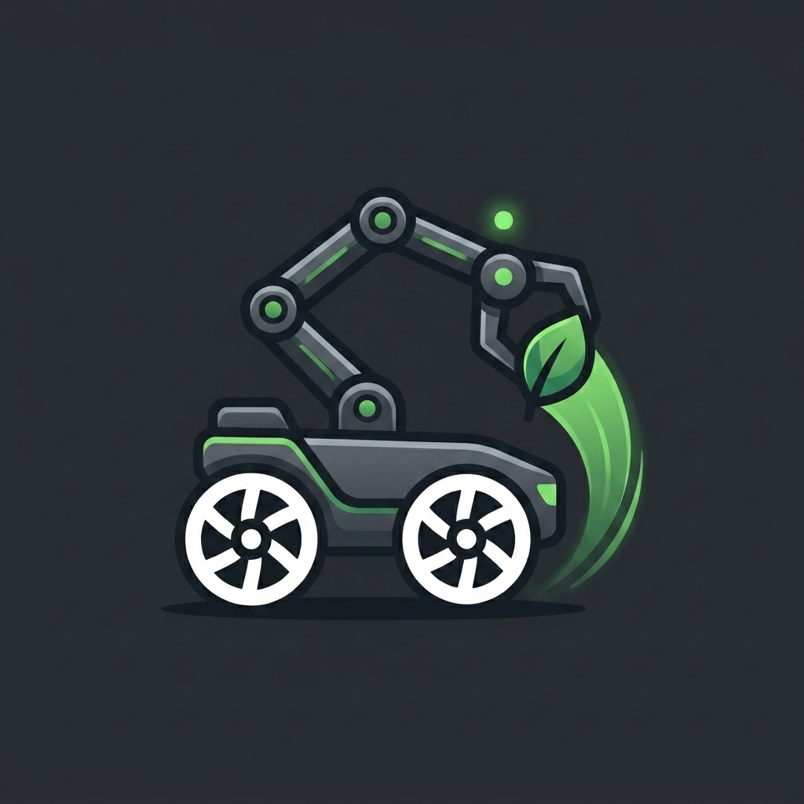
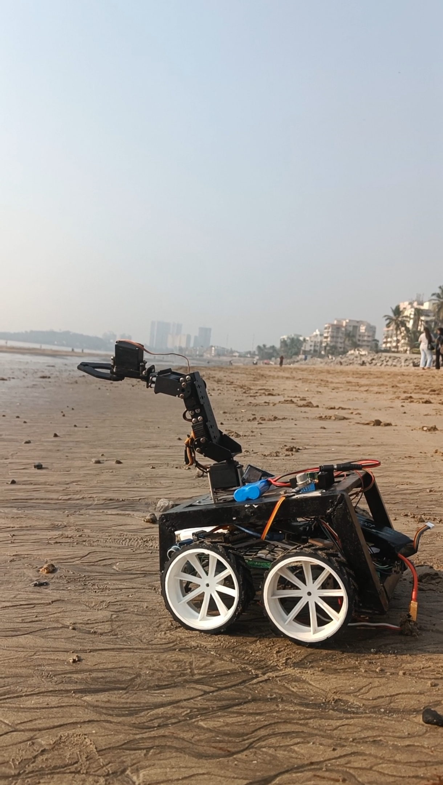
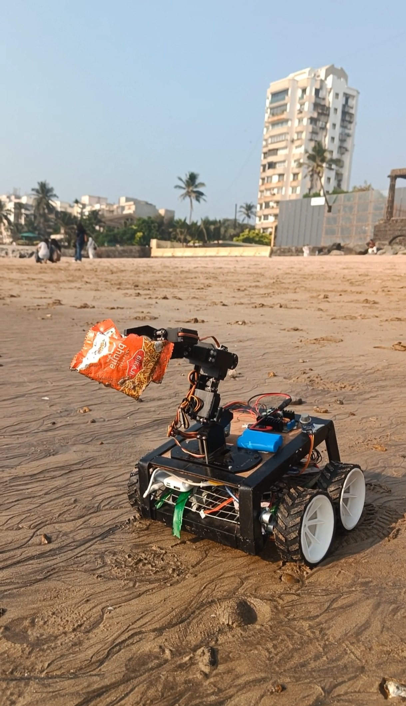
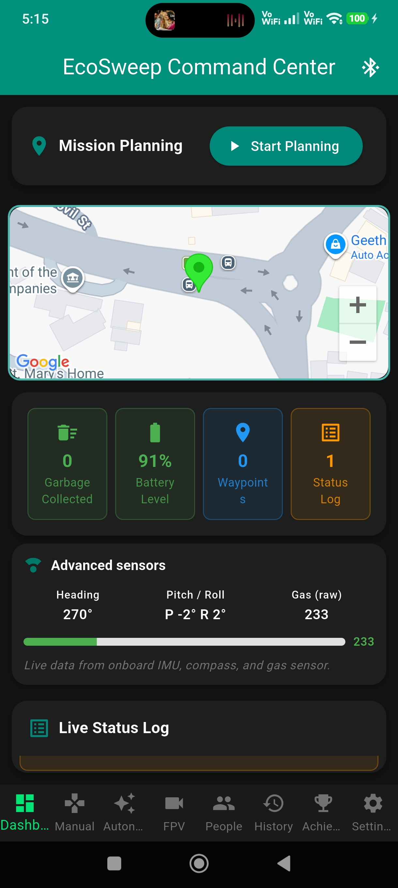
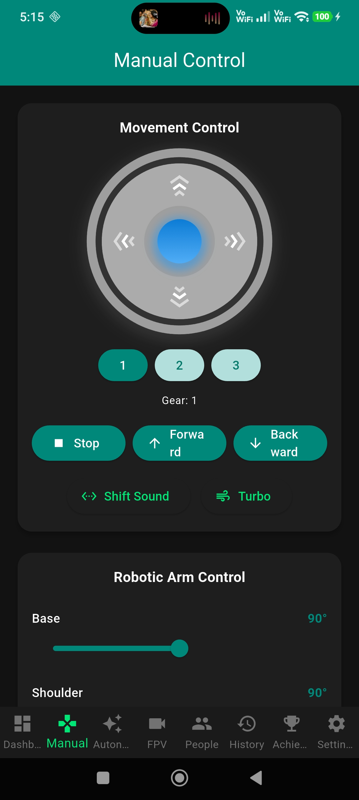
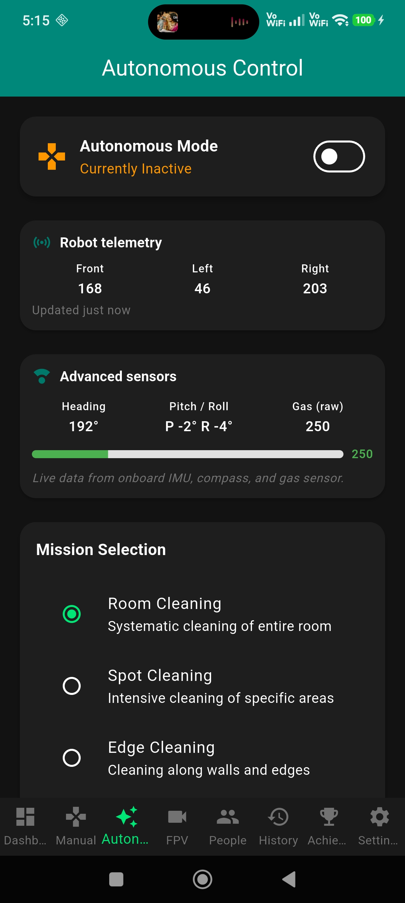
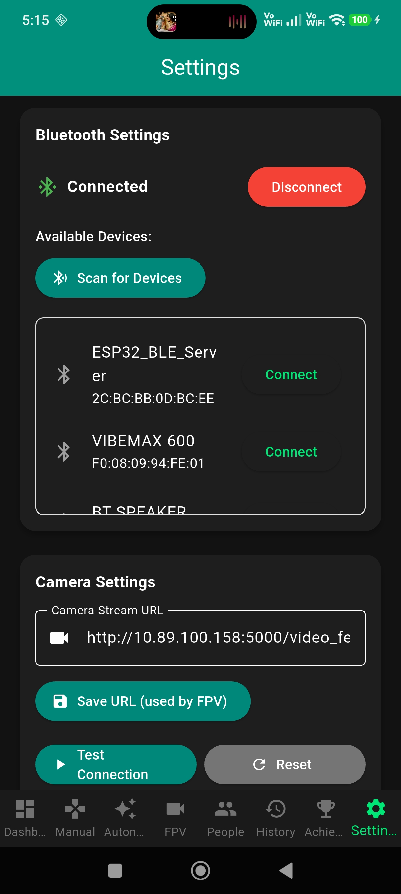

<p align="center">
  
</p>

<h1 align="center">EcoSweep</h1>

<h3 align="center">
AI-Powered Universal Cleaning & Terrain-Capable Robotic System
</h3>

<p align="center">
An intelligent robotics platform combining Embedded Systems, Artificial Intelligence, IoT, Mobile Computing, Computer Vision, and Autonomous Navigation.
</p>

<p align="center">


</p>

<h3 align="center">
  🌐 <a href="https://ecosweep-robot.netlify.app/">Live Project Website & APK Download</a>
</h3>

---

# ⚠️ Intellectual Property & Usage Restriction

> **Copyright © 2026 Farhan Sayed & Simran Singh. All Rights Reserved.**

This repository contains proprietary software, hardware architecture, PCB designs, algorithms, firmware, mobile applications, documentation, and research developed by the authors.

### The following actions are STRICTLY PROHIBITED:

❌ Copying source code
❌ Reproducing hardware designs
❌ Commercial use
❌ Reverse engineering
❌ Redistribution or republishing
❌ Modifying and claiming ownership
❌ Using any part of this project in academic or commercial work without written permission.

Unauthorized use may constitute copyright infringement and legal action may be pursued where applicable.

---

# 🚀 Overview

**EcoSweep** is a next-generation intelligent robotic cleaning system developed to automate cleaning operations across indoor, outdoor, institutional, and semi-industrial environments.

Unlike traditional robotic vacuum cleaners, EcoSweep is built as a **hybrid robotic platform** capable of navigating uneven terrain while integrating intelligent sensing, robotic manipulation, real-time communication, GPS tracking, and future AI-powered autonomy.

The project combines **Embedded Systems**, **Flutter Mobile Development**, **Artificial Intelligence**, **IoT**, and **Robotics Engineering** into a single modular architecture. 

The robot utilizes an **Arduino Mega 2560** for real-time hardware control and a **Raspberry Pi 4** for high-level processing, communication, and future AI integration.

---

# 🤖 The EcoSweep Robot

Below is the actual EcoSweep robotic prototype developed during the project. The robot integrates a hybrid **Arduino + Raspberry Pi architecture**, robotic arm, multi-terrain wheelbase, GPS navigation, sensor fusion, Bluetooth communication, and modular AI expansion capabilities.

<p align="center">

&nbsp;

</p>

---

# 📱 The Control Application

The EcoSweep mobile application (built with Flutter) acts as the primary control interface for the robot. It features a stunning Dark Mode UI with electric green accents for a premium, high-tech experience.

### ✅ Key App Features:
- **Manual Robot Control** (Joystick, Differential Steering)
- **Autonomous Mission Control**
- **Bluetooth Communication**
- **GPS Monitoring & Live Telemetry**
- **FPV Camera Streaming**
- **Interactive Demo Mode** (Test the app without hardware connected)
- **Servo Arm Control & Presets**

<p align="center">
  
  
  
  
</p>

---

# 🛠 Hardware Specifications

| Component | Specification | Description |
|-----------|---------------|-------------|
| **Microcontroller** | Arduino Mega 2560 | Low-level motor & sensor controller |
| **Processor** | Raspberry Pi 4 | High-level IoT processing & communication |
| **Motor Driver** | BTS7960 | High-current DC Motor Driver |
| **Servo Driver** | PCA9685 | Multi-DOF Robotic Arm Servo Controller |
| **GPS Module** | NEO-6M | Global positioning tracking |
| **IMU** | MPU6050 | Accelerometer & Gyroscope |
| **Compass** | HMC5883L | Digital Compass |
| **Ultrasonic** | HC-SR04 (x3) | 360-degree obstacle detection |
| **Power Supply** | Li-Po + Li-Ion | Hybrid high-current battery system |
| **Communication** | Bluetooth Classic | Low-latency mobile connection |
| **Camera** | Raspberry Pi Camera | FPV Video Streaming |

---

# 📡 System Architecture

```text
                    Flutter Application
                            │
             Bluetooth Classic (SPP)
                            │
                    Raspberry Pi 4
          ┌──────────────┬──────────────┐
          │              │              │
     Camera        Voice Engine     GPS Module
          │              │              │
          └──────────────┴──────────────┘
                            │
                      USB Serial
                            │
                   Arduino Mega 2560
                            │
      ┌────────────┬─────────────┬──────────────┐
      │            │             │              │
  DC Motors     Servo Arm    Ultrasonic     IR Sensors
```

---

# 📈 Development Timeline & Roadmap

### Phase 1: Hardware Foundation
- ✅ Chassis Assembly & Hardware Design
- ✅ Motor Driver & Power System Integration

### Phase 2: Communication & Control
- ✅ Arduino Real-Time Programming
- ✅ Bluetooth Communication Protocol
- ✅ Manual Joystick Control

### Phase 3: Mobile Dashboard
- ✅ Flutter Application Architecture
- ✅ Live Telemetry Dashboard
- ✅ Servo Arm Controls & Presets

### Phase 4: Navigation
- ✅ GPS Tracking
- ✅ Multi-Sensor Monitoring (Ultrasonic, IMU, Compass)
- ✅ FPV Camera Integration

### Phase 5 & Beyond: AI & Automation 🚧
- 🚧 Voice Assistant Integration
- 🚧 Face & Object Recognition (YOLO / OpenCV)
- 🚧 AI Autonomous Navigation & Cleaning
- 🚧 Cloud IoT Monitoring

---

# 👨‍💻 Development Team

EcoSweep is the result of extensive research and development in the fields of Embedded Systems, Robotics, Artificial Intelligence, IoT, and Mobile Application Development.

| Role | Contributor | Responsibilities |
|------|-------------|------------------|
| **Lead Robotics Engineer** | **Farhan Sayed** | System Architecture, Robotics Engineering, Flutter Application, Embedded Systems (Arduino/Pi), PCB Design, AI Integration |
| **Co-Developer** | **Simran Singh** | Robotics Development, Hardware Assembly, Testing & Validation, Documentation |

### 📞 Contact & Portfolio
- **Farhan Sayed**: [GitHub Profile](https://github.com/FarhanSayed16)

---

# 📊 Project Statistics

- **12+ Months** of active research & development
- **10,000+ Lines of Code** across Dart, C++, and Python
- **15+ Hardware Components** integrated
- **2 Processing Units** working in tandem
- **30+ Flutter Screens & Commands**
- **1 Custom Serial Protocol** for robust communication

---

<p align="center">
Made with ❤️ using<br>
<b>Flutter • Arduino • Raspberry Pi • C++ • Python</b>
</p>

<p align="center">
Designed and Developed by<br>
<b>Farhan Sayed</b><br>
Co-Developed by<br>
<b>Simran Singh</b>
</p>

<p align="center">
<b>© 2026 All Rights Reserved.</b>
</p>